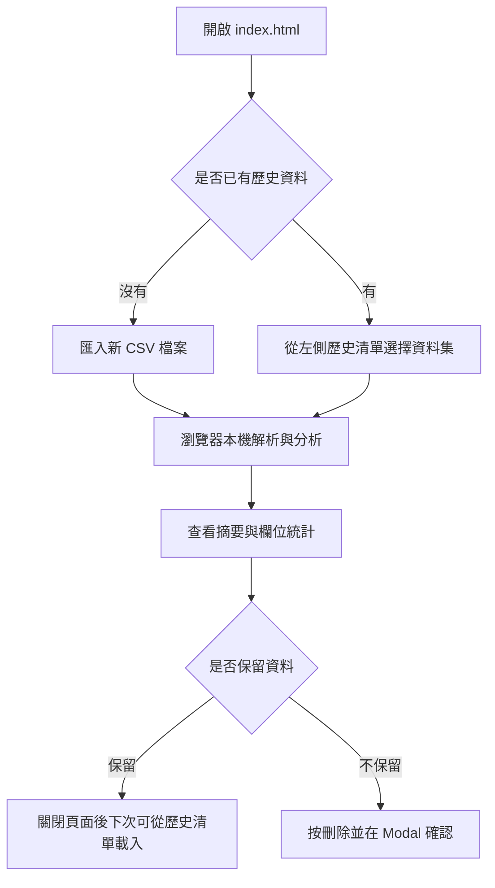
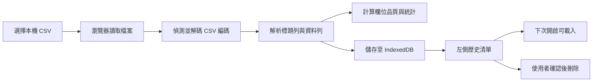

# 離線資料品質與分布分析工具 使用者操作手冊

這是一個完全在瀏覽器本機端執行的 CSV 資料品質與分布分析工具。使用者只要開啟 `index.html`，即可匯入本機 CSV，查看欄位型態、缺失值、缺失率，以及數值欄位的最小值、最大值、平均值與標準差。資料會儲存在瀏覽器 IndexedDB，不會上傳到雲端，也不需要安裝 Python、Node、Docker 或資料庫。

## 目錄

- [快速開始](#快速開始)
- [整體使用流程](#整體使用流程)
- [介面區域](#介面區域)
- [匯入與分析 CSV](#匯入與分析-csv)
- [歷史資料集操作](#歷史資料集操作)
- [UAT 範例檔案](#uat-範例檔案)
- [離線、隱私與資料安全](#離線隱私與資料安全)
- [常見問題](#常見問題)
- [維護者驗證](#維護者驗證)

## 快速開始

1. 開啟專案資料夾。
2. 直接用 Chrome、Edge、Firefox 或 Safari 開啟 `index.html`。
3. 點擊左側的「匯入新 CSV 檔案」。
4. 選擇一份 CSV 檔案。
5. 等待「正在解析 CSV 檔案...」與「正在儲存資料...」完成。
6. 在右側主畫面查看摘要與欄位分析結果。

本工具是單一 HTML 檔案，不需要啟動本機伺服器。

## 整體使用流程



## 介面區域

左側邊欄：

- 本機資料庫狀態：顯示 IndexedDB 是否可用。
- 匯入新 CSV 檔案：選擇本機 CSV。
- 歷史資料集清單：顯示已匯入並儲存在此瀏覽器的資料集。
- 刪除按鈕：移除指定資料集。

右側主畫面：

- 摘要資訊：顯示資料集名稱、匯入時間、CSV 編碼、總筆數、總欄位數。
- 分析結果表格：逐欄顯示型態、缺失值數、缺失率、最小值、最大值、平均值、標準差。
- Empty State：尚未匯入或選擇資料時，顯示操作提示。

## 匯入與分析 CSV

1. 點擊「匯入新 CSV 檔案」。
2. 選擇帶有標題列的 CSV。
3. 等待 Loading 遮罩消失。
4. 檢查右側摘要資訊是否符合檔案內容。
5. 檢查分析表格：
   - 「數值」欄位會顯示最小值、最大值、平均值、標準差。
   - 「字串」欄位的數值統計會顯示 `-`。
   - 缺失值大於 0 的欄位，缺失值數與缺失率會以紅色醒目提示。

支援的常見 CSV 編碼：

- UTF-8
- UTF-8 with BOM
- UTF-16LE with BOM
- UTF-16BE with BOM
- Big5 / CP950

若瀏覽器不支援 Big5 / CP950 解碼，請先用 Excel、LibreOffice 或文字編輯器將 CSV 另存為 UTF-8 後再匯入。

## 歷史資料集操作

匯入成功後，工具會自動把資料集儲存在目前瀏覽器的 IndexedDB。下次重新開啟 `index.html` 時，左側會列出歷史資料集。

載入歷史資料：

1. 在左側歷史清單點擊資料集名稱。
2. 等待「正在讀取資料集...」完成。
3. 右側會重新顯示該資料集的分析結果。

刪除資料：

1. 在左側歷史清單點擊資料集旁的刪除按鈕。
2. 在自訂確認視窗中確認資料集名稱。
3. 點擊「確認刪除」。

刪除會從瀏覽器本機 IndexedDB 移除完整資料。刪除後無法從工具內復原；若需要保留，請先保留原始 CSV 檔。

## UAT 範例檔案

專案提供 `uat-samples` 資料夾，可用於驗收匯入、編碼、缺失值、型態判斷與 quoted CSV 行為。

| 檔案 | 用途 |
| --- | --- |
| `01_utf8_bom_quality.csv` | UTF-8 BOM、繁中資料、缺失值、數值欄位 |
| `02_big5_cp950_quality.csv` | Big5 / CP950 繁中 CSV |
| `03_utf16le_excel_quality.csv` | UTF-16LE CSV |
| `04_utf8_quoted_edge_cases.csv` | 逗號、換行、雙引號跳脫等 quoted CSV 情境 |
| `05_utf8_numeric_type_checks.csv` | 數值/字串型態判斷與缺失值 |

建議 UAT 順序：

1. 逐一匯入五個範例檔。
2. 確認摘要中的「CSV 編碼」符合檔名描述。
3. 確認繁中文字沒有亂碼。
4. 確認缺失值欄位以紅色提示。
5. 重新整理頁面後，確認歷史資料集仍可載入。
6. 刪除一筆資料集，確認 Modal 出現且刪除後清單更新。

## 資料保存流程



## 離線、隱私與資料安全

- 工具不會呼叫外部 API。
- 工具不含 Analytics 或 Tracking code。
- CSV 內容只在瀏覽器本機端讀取、分析與儲存。
- 歷史資料存在目前瀏覽器的 IndexedDB，不會同步到其他瀏覽器或其他電腦。
- 若使用無痕模式或隱私模式，瀏覽器可能限制 IndexedDB，資料可能無法保存或關閉後消失。
- 若清除瀏覽器網站資料、IndexedDB 或快取，歷史資料集可能會消失。

## 常見問題

### 開啟後看不到歷史資料怎麼辦？

請確認使用的是同一台電腦、同一個瀏覽器、同一個瀏覽器設定檔。歷史資料存在瀏覽器 IndexedDB，不會跟著 CSV 檔案或 HTML 檔案移動。

### 為什麼 Big5 CSV 還是亂碼或匯入失敗？

目前工具會使用瀏覽器內建 `TextDecoder("big5")` 解碼 Big5 / CP950。若瀏覽器不支援，或檔案不是標準 Big5 / CP950，請將 CSV 另存為 UTF-8 後再匯入。

### 為什麼某個欄位被判定為字串？

只要該欄位有任何非空值無法轉成有效數字，整個欄位就會被判定為「字串」。例如同一欄同時有 `123` 與 `ABC`，該欄會顯示為字串。

### 空值怎麼計算？

空白字串、只含空白的內容、`null`、`undefined` 都會被視為缺失值。缺失率等於缺失值數除以總筆數。

### 可以匯出分析結果嗎？

v1.0 不支援匯出分析結果，也不支援資料清洗或編輯。若需要保存結果，請使用瀏覽器列印、截圖，或保留原始 CSV 後重新匯入分析。

## 維護者驗證

以下命令用於維護者檢查，不是一般使用者啟動工具所需步驟。

執行編碼、CSV 解析與分析邏輯測試：

```powershell
node tests/encoding.test.js
```

檢查 `index.html` 內嵌 JavaScript 語法、外部依賴與原生對話框：

```powershell
node -e "const fs=require('fs');const html=fs.readFileSync('index.html','utf8');const scripts=[...html.matchAll(/<script>([\s\S]*?)<\/script>/g)].map(m=>m[1]);if(!scripts.length) throw new Error('missing script');for(const s of scripts) new Function(s);if(/https?:\/\//i.test(html)) throw new Error('external URL found');if(/cdn/i.test(html)) throw new Error('CDN reference found');if(/\b(confirm|alert)\s*\(/.test(html)) throw new Error('native modal API found');console.log('HTML script syntax OK; offline/native-dialog checks OK.');"
```

用 UTF-8 讀取 README，確認繁體中文未亂碼：

```powershell
[Console]::OutputEncoding=[System.Text.Encoding]::UTF8
[System.IO.File]::ReadAllText((Resolve-Path 'README.md'), [System.Text.Encoding]::UTF8)
```
