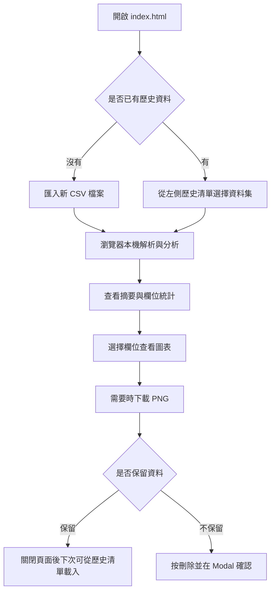
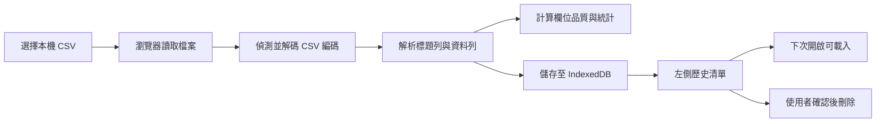

# 離線資料品質與分布分析工具 使用者操作手冊

這是一個完全在瀏覽器本機端執行的 CSV 資料品質與分布分析工具。使用者只要開啟 `index.html`，即可匯入本機 CSV，查看欄位型態、缺失值、缺失率、數值分布統計，並產生單欄位圖表與多欄位進階圖表（散佈圖、交叉頻率表、箱型圖、品質總覽、時間序列），也能下載 PNG 圖片。資料會儲存在瀏覽器 IndexedDB，不會上傳到雲端，也不需要安裝 Python、Node、Docker 或資料庫。

## 目錄

- [快速開始](#快速開始)
- [整體使用流程](#整體使用流程)
- [介面區域](#介面區域)
- [匯入與分析 CSV](#匯入與分析-csv)
- [欄位視覺化與圖片下載](#欄位視覺化與圖片下載)
- [歷史資料集操作](#歷史資料集操作)
- [UAT 範例檔案](#uat-範例檔案)
- [離線、隱私與資料安全](#離線隱私與資料安全)
- [常見問題](#常見問題)
- [維護者驗證](#維護者驗證)

## 快速開始

1. 開啟專案資料夾。
2. 直接用 Chrome、Edge、Firefox 或 Safari 開啟 `index.html`。
3. 點擊左側的「匯入新 CSV 檔案」。
4. 選擇一份 CSV 檔案。
5. 等待「正在解析 CSV 檔案...」與「正在儲存資料...」完成。
6. 在右側主畫面查看摘要與欄位分析結果。

本工具是單一 HTML 檔案，不需要啟動本機伺服器。

## 整體使用流程



## 介面區域

左側邊欄：

- 本機資料庫狀態：顯示 IndexedDB 是否可用。
- 匯入新 CSV 檔案：選擇本機 CSV。
- 歷史資料集清單：顯示已匯入並儲存在此瀏覽器的資料集。
- 歷史搜尋：依檔名快速篩選已儲存的資料集。
- 刪除按鈕：移除指定資料集。

右側主畫面：

- 摘要資訊：顯示資料集名稱、匯入時間、CSV 編碼、總筆數、總欄位數。
- 分析結果表格：可依「品質」、「數值分布」、「字串分布」切換欄位統計。
- 欄位搜尋與排序：可依欄位名稱搜尋，並依原始順序、欄名、型態、缺失率或唯一值數排序。
- 欄位視覺化：可選擇單一欄位，依欄位型態查看五數摘要圖、直方圖或常見值長條圖；並可切換至「進階圖表」查看散佈圖、交叉頻率表、箱型圖、資料品質總覽或時間序列折線圖。
- 圖表圖片下載：可將目前 Canvas 圖表下載為 PNG。
- 匯出分析報告：可匯出 JSON 或 Big5 編碼 CSV 格式的統計摘要，不匯出原始資料列。
- Empty State：尚未匯入或選擇資料時，顯示操作提示。

## 匯入與分析 CSV

1. 點擊「匯入新 CSV 檔案」。
2. 選擇帶有標題列的 CSV。
3. 等待 Loading 遮罩消失。
4. 檢查右側摘要資訊是否符合檔案內容。
5. 檢查分析表格：
   - 「品質」頁籤會顯示型態、缺失值數、缺失率與唯一值數。
   - 「數值分布」頁籤會顯示最小值、P25、中位數、P75、最大值、平均值、標準差、零值數與負值數。
   - 「字串分布」頁籤會顯示唯一值數、前 5 常見值、最短長度與最長長度。
   - 不適用的統計欄位會顯示 `-`。
   - 缺失值大於 0 的欄位，缺失值數與缺失率會以紅色醒目提示。
6. 如需保存分析摘要，可點擊「匯出 JSON」或「匯出 CSV」。CSV 匯出檔會使用 Big5 編碼，檔名包含 `analysis-big5`；匯出檔只包含統計結果，不包含 CSV 原始資料列。

支援的常見 CSV 編碼：

- UTF-8
- UTF-8 with BOM
- UTF-16LE with BOM
- UTF-16BE with BOM
- Big5 / CP950

若瀏覽器不支援 Big5 / CP950 解碼，請先用 Excel、LibreOffice 或文字編輯器將 CSV 另存為 UTF-8 後再匯入。

## 欄位視覺化與圖片下載

匯入或載入資料集後，分析結果上方會出現「欄位視覺化」區塊，並提供「單欄圖表」與「進階圖表」兩種模式切換。

### 單欄圖表

1. 在「欄位」下拉選單選擇要檢視的欄位。
2. 若欄位為「數值」，可切換：
   - 五數摘要：顯示最小值、P25、中位數、P75、最大值。
   - 直方圖：以預設 10 個區間呈現數值分布。
3. 若欄位為「字串」，圖表會顯示前 5 常見值長條圖。
4. 點擊「下載 PNG」可下載目前圖表。檔名會包含原始 CSV 檔名與欄位名稱。

### 進階圖表

切換至「進階圖表」後，從「圖表種類」下拉選擇圖表，系統會依種類顯示對應的欄位選項：

| 圖表 | 需選擇欄位 | 說明 |
| --- | --- | --- |
| 散佈圖與相關性 | 兩個數值欄位（X、Y） | 散點圖、Pearson 相關係數，可切換顯示線性趨勢線 |
| 字串交叉頻率表 | 兩個字串欄位（列、欄） | 熱力矩陣含小計；統計值可切換為筆數、平均值或總和（平均/總和需另選數值欄位） |
| 箱型圖（異常值標註） | 一個數值欄位 | 以 IQR 計算圍籬並標註離群值個數與數值 |
| 資料品質總覽 | 不需選擇 | 各欄位缺失率長條圖與欄位型別分佈圓餅圖 |
| 時間序列折線圖 | 一個日期欄位＋一個數值欄位 | 日期欄位自動偵測 ISO 或常用日期格式；重複日期可依平均或總和彙總 |

進階圖表若欄位不足（例如少於兩個數值欄位時無法繪製散佈圖），會顯示提示並停用下載。交叉表維度過大時會自動把低頻值彙整至「其他」。圖表訊息列會顯示相關係數、離群值與圍籬、彙總方式等統計資訊。

圖表只根據目前載入的本機資料集繪製，不會上傳資料，也不會載入任何外部圖表套件。

## 歷史資料集操作

匯入成功後，工具會自動把資料集儲存在目前瀏覽器的 IndexedDB。下次重新開啟 `index.html` 時，左側會列出歷史資料集。

載入歷史資料：

1. 在左側歷史清單點擊資料集名稱。
2. 等待「正在讀取資料集...」完成。
3. 右側會重新顯示該資料集的分析結果。

刪除資料：

1. 在左側歷史清單點擊資料集旁的刪除按鈕。
2. 在自訂確認視窗中確認資料集名稱。
3. 點擊「確認刪除」。

刪除會從瀏覽器本機 IndexedDB 移除完整資料。刪除後無法從工具內復原；若需要保留，請先保留原始 CSV 檔。

## UAT 範例檔案

專案提供 `uat-samples` 資料夾，可用於驗收匯入、編碼、缺失值、型態判斷與 quoted CSV 行為。

| 檔案 | 用途 |
| --- | --- |
| `01_utf8_bom_quality.csv` | UTF-8 BOM、繁中資料、缺失值、數值欄位 |
| `02_big5_cp950_quality.csv` | Big5 / CP950 繁中 CSV |
| `03_utf16le_excel_quality.csv` | UTF-16LE CSV |
| `04_utf8_quoted_edge_cases.csv` | 逗號、換行、雙引號跳脫等 quoted CSV 情境 |
| `05_utf8_numeric_type_checks.csv` | 數值/字串型態判斷與缺失值 |
| `06_utf8_advanced_charts.csv` | 進階圖表：兩數值欄位、兩個字串分類欄、ISO 日期欄與數值指標欄 |

建議 UAT 順序：

1. 逐一匯入六個範例檔。
2. 確認摘要中的「CSV 編碼」符合檔名描述。
3. 確認繁中文字沒有亂碼。
4. 確認缺失值欄位以紅色提示。
5. 選擇數值欄位，確認可切換五數摘要與直方圖，並可下載 PNG。
6. 選擇字串欄位，確認常見值長條圖可正常顯示並可下載 PNG。
7. 切換至「進階圖表」，逐一確認：
   - 散佈圖：選擇兩個數值欄位，確認散點、相關係數與趨勢線顯示，可下載 PNG。
   - 交叉頻率表：選擇兩個字串欄位，切換筆數/平均/總和，確認矩陣、小計與「其他」彙整。
   - 箱型圖：選擇含極值欄位，確認離群值標註與圍籬說明。
   - 品質總覽：不需選欄位，確認缺失率橫條與型別圓餅。
   - 時間序列：選擇日期與數值欄位，確認折線與平均/總和彙總。
8. 重新整理頁面後，確認歷史資料集仍可載入。
9. 刪除一筆資料集，確認 Modal 出現且刪除後清單更新。

## 資料保存流程



## 離線、隱私與資料安全

- 工具不會呼叫外部 API。
- 工具不含 Analytics 或 Tracking code。
- CSV 內容只在瀏覽器本機端讀取、分析與儲存。
- 歷史資料存在目前瀏覽器的 IndexedDB，不會同步到其他瀏覽器或其他電腦。
- 若使用無痕模式或隱私模式，瀏覽器可能限制 IndexedDB，資料可能無法保存或關閉後消失。
- 若清除瀏覽器網站資料、IndexedDB 或快取，歷史資料集可能會消失。

## 常見問題

### 開啟後看不到歷史資料怎麼辦？

請確認使用的是同一台電腦、同一個瀏覽器、同一個瀏覽器設定檔。歷史資料存在瀏覽器 IndexedDB，不會跟著 CSV 檔案或 HTML 檔案移動。

### 為什麼 Big5 CSV 還是亂碼或匯入失敗？

目前工具會使用瀏覽器內建 `TextDecoder("big5")` 解碼 Big5 / CP950。若瀏覽器不支援，或檔案不是標準 Big5 / CP950，請將 CSV 另存為 UTF-8 後再匯入。

### 為什麼某個欄位被判定為字串？

只要該欄位有任何非空值無法轉成有效數字，整個欄位就會被判定為「字串」。例如同一欄同時有 `123` 與 `ABC`，該欄會顯示為字串。

### 空值怎麼計算？

空白字串、只含空白的內容、`null`、`undefined` 都會被視為缺失值。缺失率等於缺失值數除以總筆數。

### 可以匯出分析結果嗎？

可以。工具支援匯出 JSON 或 Big5 編碼 CSV 格式的分析摘要，內容包含資料集名稱、匯入時間、編碼、行列數與各欄位統計。CSV 檔名會以 `analysis-big5.csv` 結尾，方便用需要 Big5/CP950 的試算表或內部系統開啟。匯出內容不包含原始資料列。工具仍不支援資料清洗或編輯；若需要重新分析，請保留原始 CSV 檔。

## 維護者驗證

以下命令用於維護者檢查，不是一般使用者啟動工具所需步驟。

執行編碼、CSV 解析與分析邏輯測試：

```powershell
node tests/encoding.test.js
```

檢查 `index.html` 內嵌 JavaScript 語法、外部依賴與原生對話框：

```powershell
node -e "const fs=require('fs');const html=fs.readFileSync('index.html','utf8');const scripts=[...html.matchAll(/<script>([\s\S]*?)<\/script>/g)].map(m=>m[1]);if(!scripts.length) throw new Error('missing script');for(const s of scripts) new Function(s);if(/https?:\/\//i.test(html)) throw new Error('external URL found');if(/cdn/i.test(html)) throw new Error('CDN reference found');if(/\b(confirm|alert)\s*\(/.test(html)) throw new Error('native modal API found');console.log('HTML script syntax OK; offline/native-dialog checks OK.');"
```

用 UTF-8 讀取 README，確認繁體中文未亂碼：

```powershell
[Console]::OutputEncoding=[System.Text.Encoding]::UTF8
[System.IO.File]::ReadAllText((Resolve-Path 'README.md'), [System.Text.Encoding]::UTF8)
```
